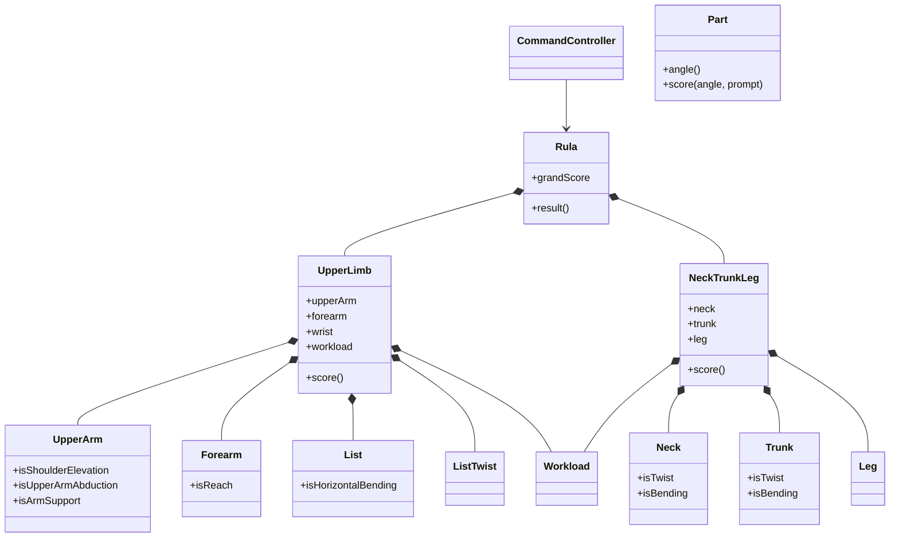

```mermaid
classDiagram
  class Rula {
    +result()
    +grandScore
  }

  class CommandController {

  }

  class Part {
    +angle()
    +score(angle, prompt)
  }

  class UpperLimb {
    +score()
    +upperArm
    +forearm
    +wrist
    +workload
  }

  class UpperArm {
    +isShoulderElevation
    +isUpperArmAbduction
    +isArmSupport
  }

  class Forearm {
    +isReach
  }

  class List {
    +isHorizontalBending
  }

  class ListTwist {

  }

  class NeckTrunkLeg {
    +score()
    +neck
    +trunk
    +leg
  }

  class Neck {
    +isTwist
    +isBending
  }

  class Trunk {
    +isTwist
    +isBending
  }

  class Leg {

  }

  class Workload {

  }

  CommandController --> Rula
  Rula *-- UpperLimb
  Rula *-- NeckTrunkLeg
  UpperLimb *-- UpperArm
  UpperLimb *-- Forearm
  UpperLimb *-- List
  UpperLimb *-- ListTwist
  UpperLimb *-- Workload
  NeckTrunkLeg *-- Neck
  NeckTrunkLeg *-- Trunk
  NeckTrunkLeg *-- Leg
  NeckTrunkLeg *-- Workload


```
