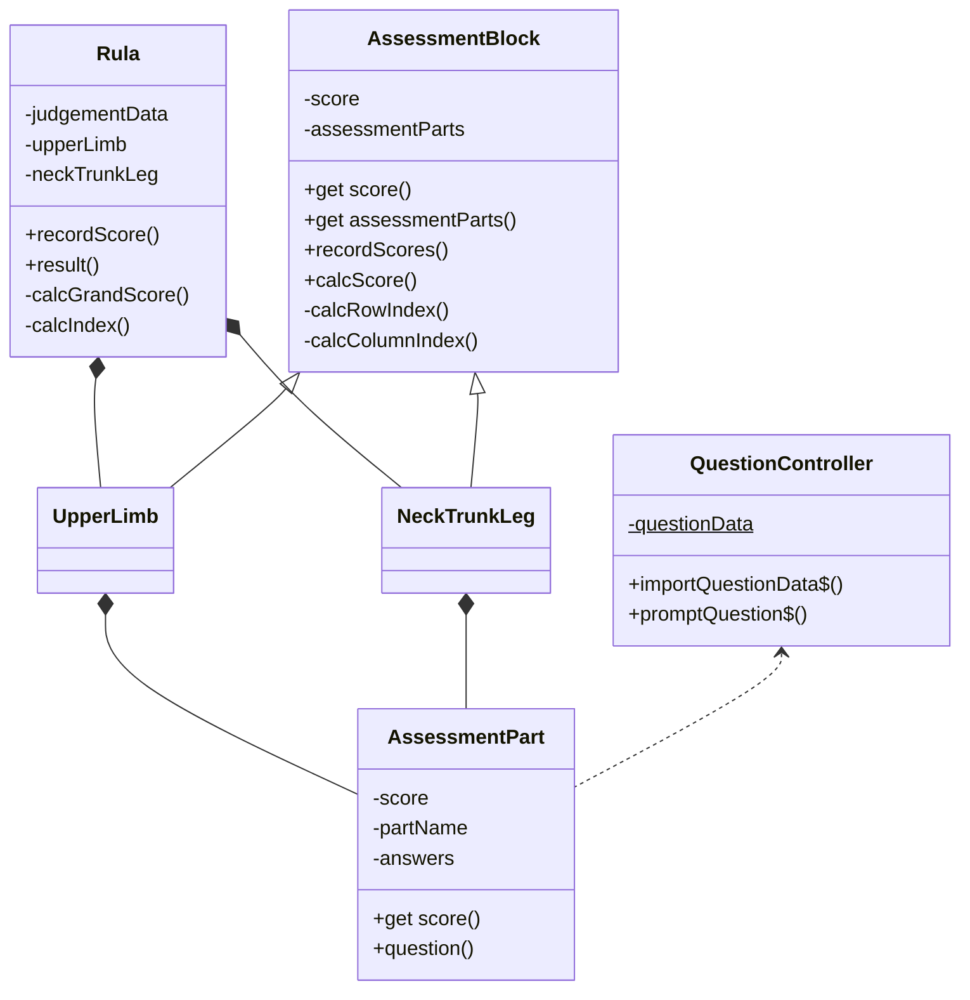

```mermaid
classDiagram
  class Rula {
    -judgementData
    -upperLimb
    -neckTrunkLeg
    +recordScore()
    +result()
    -calcGrandScore()
    -calcIndex()
  }

  class AssessmentBlock {
    -score
    -assessmentParts
    +get score()
    +get assessmentParts()
    +recordScores()
    +calcScore()
    -calcRowIndex()
    -calcColumnIndex()
  }

  class UpperLimb {
  }

  class NeckTrunkLeg {
  }

  class AssessmentPart {
    -score
    -partName
    -answers
    +get score()
    +question()
  }

  class QuestionController {
    -questionData$
    +importQuestionData$()
    +promptQuestion$()
  }

  Rula *-- UpperLimb
  Rula *-- NeckTrunkLeg
  UpperLimb *-- AssessmentPart
  NeckTrunkLeg *-- AssessmentPart
  AssessmentBlock <|-- UpperLimb
  AssessmentBlock <|-- NeckTrunkLeg
  QuestionController <.. AssessmentPart
```
